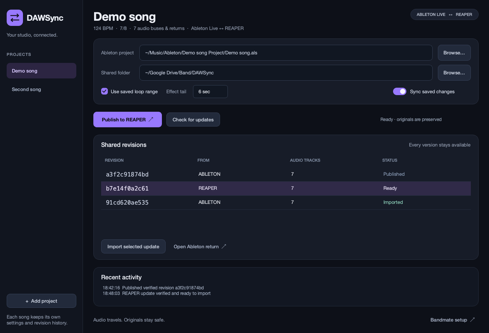
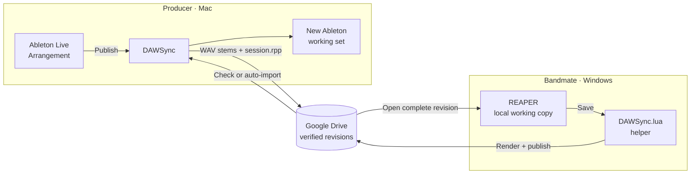
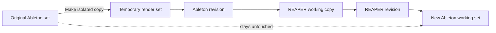

# DAWSync

DAWSync turns an Ableton Live Arrangement into a portable REAPER project and brings a bandmate's REAPER changes back into a new Ableton working set. It is built for bands who share projects through Google Drive and want each person to keep using their own DAW.

It exchanges rendered audio, markers, tempo, and timing. Plugins, MIDI devices, and DAW-specific automation stay editable in their native project and are printed into the audio handoff.

> [!IMPORTANT]
> DAWSync is an early preview. The current Mac build has been exercised locally with Ableton Live 12.4.5 and REAPER 7.81. The generated project is designed for REAPER 7 on Windows, but a native Windows compatibility pass is still pending. Release builds are ad-hoc signed but not yet Apple-notarized.



## Download

Download the latest build from [GitHub Releases](https://github.com/manthan787/dawsync/releases/latest):

- **Apple Silicon** for M-series Macs
- **Intel** for Intel Macs
- **REAPER helper** for the two dependency-free Lua files and Windows instructions

Unzip the Mac download, Control-click **DAWSync**, and choose **Open** the first time. This is the standard one-time path for an app that is signed but not yet notarized. macOS will separately request Accessibility and Automation access when DAWSync first controls Ableton.

Each release includes `SHA256SUMS.txt` for verifying the downloads. The REAPER helper is already bundled into every project exported by DAWSync, so bandmates normally do not need the separate helper download.

## How the round trip works



Every publish creates a new, immutable revision. DAWSync never edits the source Ableton set or a revision already shared through Drive.



## What everyone needs

| Person | Required |
| --- | --- |
| Ableton producer | macOS, Ableton Live 12 Standard, and the DAWSync app |
| REAPER bandmate | REAPER 7 and the complete exported revision folder |
| Everyone | Google Drive for desktop, with the shared exchange folder available offline |

Your bandmate needs no plugin, Python install, SWS extension, or DAWSync app to audition the handoff. They can open `session.rpp` directly. To send edits back automatically, they load the included `DAWSync.lua` action once and run it whenever REAPER restarts.

## First export from Ableton

1. Save the Live set and stop playback or recording.
2. Open DAWSync and choose **Add project**.
3. Select the `.als` file and the band's locally synced Google Drive folder.
4. Choose the render range. A saved loop must start at `1.1.1`; otherwise, turn off **Use saved loop range** to export the complete Arrangement.
5. Set an effect tail long enough for the song's reverbs and delays. Four seconds is the default.
6. Select **Publish to REAPER** and let Live finish the automated export.
7. Wait for Google Drive to finish syncing before sharing or opening the revision on another computer.

macOS may ask for Accessibility and Automation access the first time DAWSync controls Live's export window. Enable DAWSync in **System Settings → Privacy & Security → Accessibility**, then retry the publish. DAWSync leaves save, missing-media, and plugin prompts for you to resolve.

The left sidebar stores a separate profile for each song. Each profile remembers its source set, shared folder, loop choice, effect tail, current working set, and revision history. Automatic sync watches only the selected song and starts disabled whenever DAWSync launches.

## Opening the handoff in REAPER

Open the complete revision folder only after Drive finishes downloading it:

```text
<shared folder>/
  <project-id>/
    revisions/
      <revision-id>/
        session.rpp
        manifest.json
        DAWSync.lua
        codec.lua
        audio/
          t_als_17_bass.wav
          reference_main_main_mix.wav
```

Keep that folder together. The project uses short ASCII filenames and relative media paths so it can move between macOS and Windows without path or filename changes. Track names remain readable inside REAPER, and the provided main mix is muted for reference.

For a quick compatibility check, the bandmate only opens `session.rpp`. For a full round trip, follow the one-time helper setup in [Windows and REAPER setup](docs/WINDOWS.md).

## Bringing a REAPER update back

After the bandmate saves with the helper running, Drive receives a new verified revision. On the Mac:

1. Select the song in DAWSync.
2. Choose **Check for updates**.
3. Select the revision marked **Ready**.
4. Choose **Import selected update**, then **Open Ableton return**.

DAWSync creates a new Ableton set. Returned tracks start at `1.1.1`, use unity gain, have Warp disabled, and contain the printed REAPER edits and processing. The previous Ableton tracks remain in the new set with their outputs disabled, while the original `.als` file remains untouched.

With **Sync saved changes** enabled, DAWSync watches the selected Ableton set and checks Drive periodically. It pauses on errors or simultaneous branches so you can choose which version should continue. It does not merge two people's musical changes automatically.

## Troubleshooting

| Symptom | What to do |
| --- | --- |
| Publish waits indefinitely | Stop playback and recording in Live, then resolve any open Live dialog. |
| macOS blocks the export controls | Allow DAWSync under **Privacy & Security → Accessibility** and approve Automation access when prompted. |
| Loop export is rejected | Move the saved loop start to `1.1.1`, or export the whole Arrangement. |
| Revision says **Waiting for Drive** | Keep the folder available offline and wait for every file to finish syncing. DAWSync verifies file sizes and checksums. |
| REAPER reports missing media | Open `session.rpp` in place and keep its sibling `audio` folder unchanged. |
| The bandmate's saves do not appear | Run the DAWSync action again after restarting REAPER, save the local working copy, and wait until playback stops. |
| DAWSync shows a separate branch | Two people published from the same parent revision. Select the branch to continue; both versions remain available. |
| A long reverb is cut off | Increase **Effect tail** before the next Ableton publish. The REAPER helper currently adds four seconds on return. |

## Current scope

DAWSync currently supports Arrangement View, constant tempo, constant time signatures such as 3/4, 5/4, 6/8, and 7/8, mono or stereo RIFF WAV up to 192 kHz, top-level buses, separate returns, markers, printed effects and automation, and a muted master reference. Tempo or time-signature changes within a song, RF64, multichannel audio, editable MIDI exchange, and translation of plugin parameters are outside this version.

Printed stems are not always an exact decomposition of a mix with nonlinear bus or master processing. Use the included main reference when checking the handoff.

Local settings, render jobs, returned sets, revision state, and error logs live in `~/Library/Application Support/DAWSync`. Private songs and rendered audio are excluded from the repository.

To run from source, build the macOS app, use the CLI, or understand the package format, see the [development guide](docs/DEVELOPMENT.md).
